# Pet Segmentation and Breed Classification with U-Net and Attention U-Net

A multi-task deep learning project on the Oxford-IIIT Pet dataset. A single network predicts a binary foreground/background segmentation mask and the pet breed at the same time, using a shared encoder with two heads. Two architectures are implemented and compared: a standard U-Net and an Attention U-Net with attention gates on the skip connections.

You can try out with your own pet images from here: [Website](https://iiit-pet-unet-attentionunet-segmentation-classification-fnnmho.streamlit.app/) (deployed with streamlit)

---

## Table of Contents

- [Dataset](#dataset)
- [Exploratory Data Analysis](#exploratory-data-analysis)
- [Preprocessing](#preprocessing)
- [Data Splitting](#data-splitting)
- [Models](#models)
- [Training Setup](#training-setup)
- [Results](#results)
- [Additional Experiments](#additional-experiments)
- [Acknowledgements](#acknowledgements)

---

## Dataset

The [Oxford-IIIT Pet dataset](https://www.robots.ox.ac.uk/~vgg/data/pets/) is used, consisting of pet images, per-pixel trimap annotations, and a `list.txt` annotation file containing the filename, class (breed) id, and species id.

- 37 breed classes (`class_id_to_breed`), mapped to 2 species (cat / dog)
- Trimap labels are remapped to a binary mask: label `2` (background) becomes `0`, labels `1` and `3` (foreground and boundary) become `1`
- Class and species ids from `list.txt` are converted to 0-indexed values
- Species is not predicted directly; the model predicts the breed, and `breed_to_species()` maps the predicted breed id back to cat or dog

Images and masks are loaded through a custom `MyDataset` (`torch.utils.data.Dataset`) that returns the image, binary mask, breed id, species id, and filename.

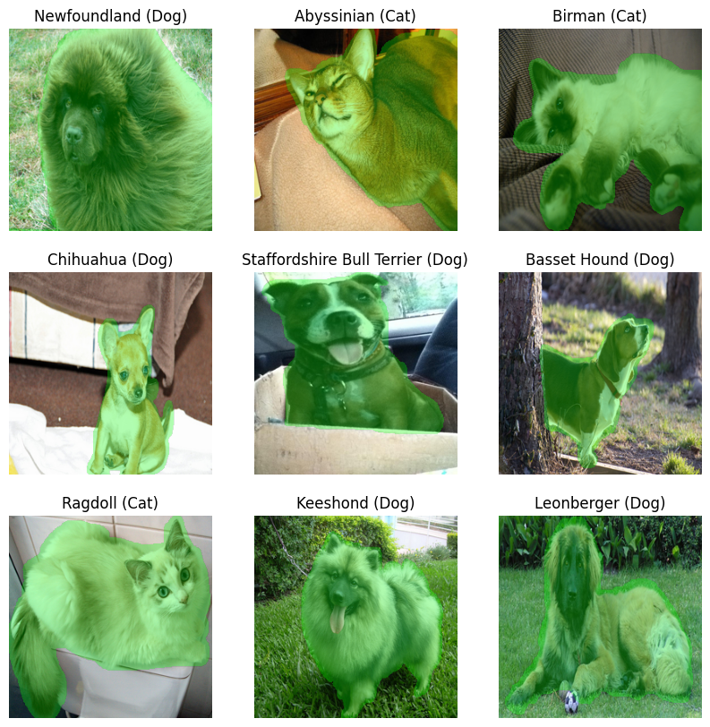

---

## Exploratory Data Analysis

### Foreground ratio

The proportion of foreground pixels was computed for every mask over the 256×256 grid.

| Statistic | Value |
|---|---|
| Mean foreground ratio | 0.418 |
| Min foreground ratio | 0.000 |
| Max foreground ratio | 0.999 |

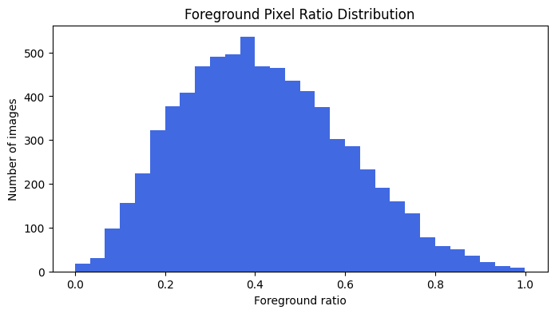

The distribution is right-skewed. Very low foreground ratios introduce more background noise than useful signal, while very high ratios give the model almost no background to learn from.

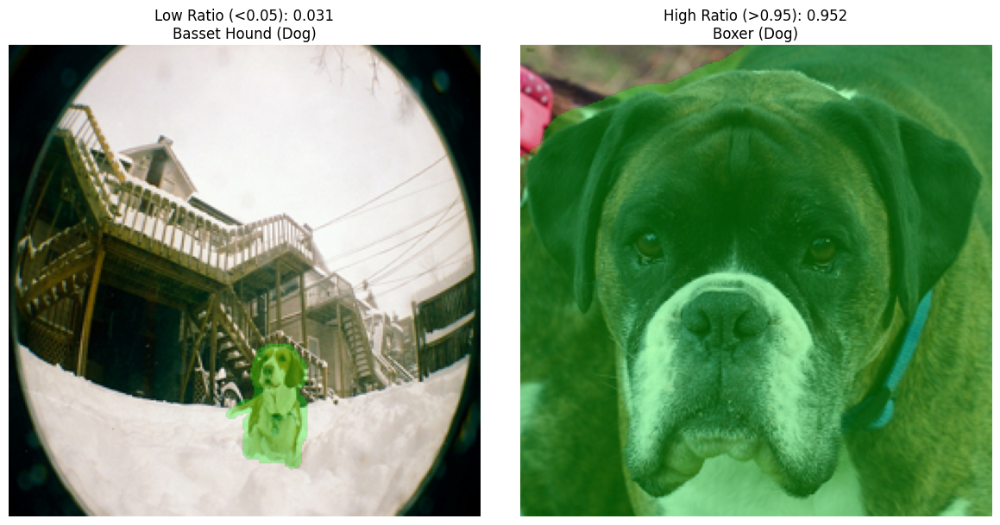

Based on this, samples with a foreground ratio below 0.05 or above 0.95 were dropped:

- Original dataset size: 7348
- Cleaned dataset size: 7305
- Entries removed: 43

The mean foreground ratio of 0.418 is also reused later as the `pos_weight` for the segmentation loss.

### Class distribution

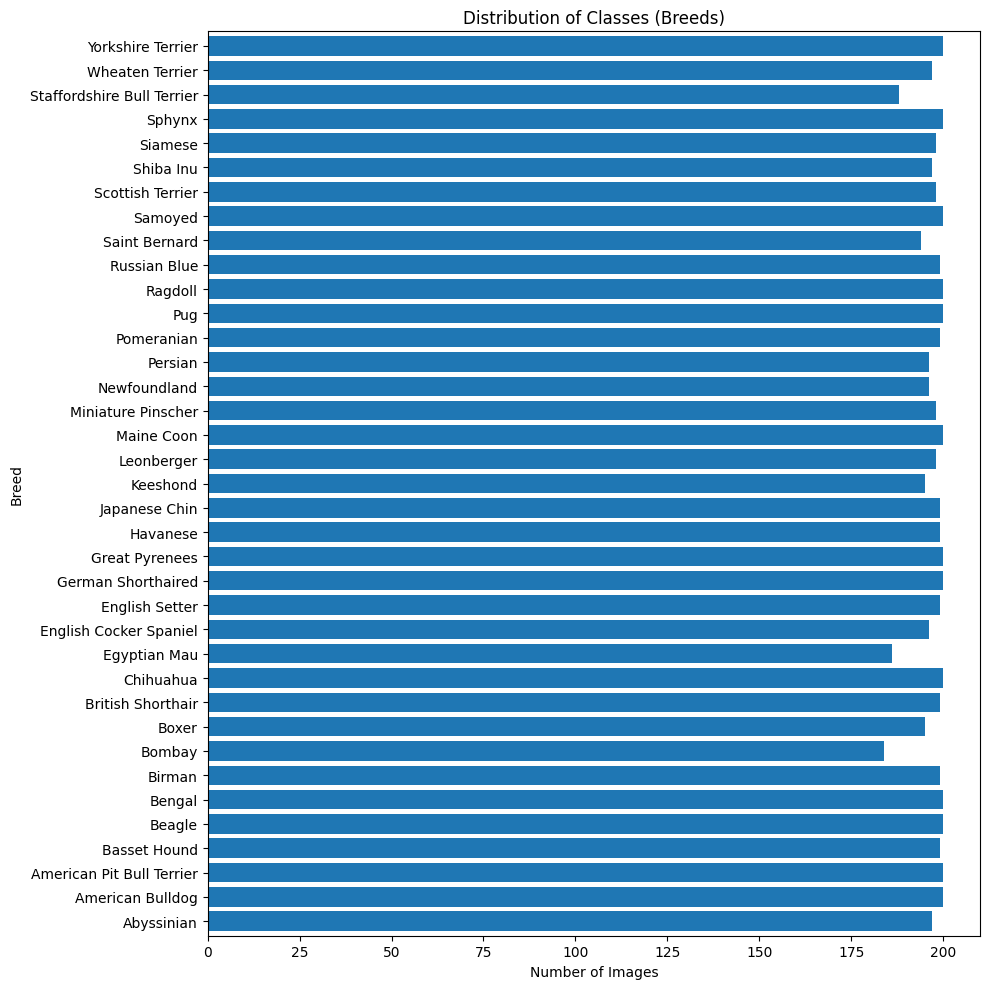

Breed counts are fairly balanced (minimum 184, maximum 200 images per breed), but the species split is not: there are roughly half as many cat images as dog images. This motivated two decisions:

1. Train on breed labels and derive species from the predicted breed, instead of training on the imbalanced species label directly.
2. Use stratified splitting on breed and balanced class weights to avoid bias across breeds.

Since each breed only has around 185–200 images, data augmentation was added to compensate for the limited per-class data.

---

## Preprocessing

Handled inside `MyDataset.__getitem__` and the transform pipelines:

- **Resizing** — all images resized to 256×256 (bicubic for images, nearest neighbour for masks so label values are preserved)
- **Normalization** — pixel values converted from the 0–255 range to 0–1 floats
- **Mask remapping** — trimap converted to a binary foreground mask
- **Augmentation (train only)** — `RandomHorizontalFlip(p=0.5)` and `ColorJitter(brightness=0.2, contrast=0.2, saturation=0.2, hue=0.1)`
- **Validation/test** — conversion to tensor only, no augmentation

Masks are wrapped as `torchvision.tv_tensors.Mask` so geometric transforms are applied consistently to the image and its mask.

Class weights for the classification loss are computed with `sklearn.utils.class_weight.compute_class_weight(class_weight='balanced')` on the training breeds.

---

## Data Splitting

Split at the dataframe level, stratified by breed, with `random_state=42`:

| Split | Size |
|---|---|
| Total (cleaned) | 7305 |
| Train | 4090 |
| Validation | 1023 |
| Test | 2192 |

A 70/30 train-test split is applied first, then 20% of the training portion is held out for validation. Data loaders use a batch size of 32, with shuffling enabled for training only.

---

## Models

Both models share the same encoder structure, the same classification head, and the same output convolution, so the comparison isolates the effect of the attention gates.

### U-Net

- **Encoder** — `DoubleConv` stem (3 → 64) followed by four `Down` blocks (max pool + double conv): 64 → 128 → 256 → 512 → 1024
- **Decoder** — four `Up` blocks using `ConvTranspose2d` for upsampling, with the encoder feature map center-cropped and concatenated to the upsampled feature map
- **Segmentation head** — 1×1 convolution producing a single-channel logit map
- **Classification head** — attached to the 1024-channel bottleneck: `AdaptiveAvgPool2d(1) → Flatten → Linear(1024, 37)`

Each `DoubleConv` block is Conv → BatchNorm → ReLU, twice, with 3×3 kernels and padding 1.

### Attention U-Net

Identical to the U-Net, except each decoder stage is a `UpAttention` block containing an `AttentionGate`:

- The gating signal `g` is the upsampled decoder feature map; `x` is the corresponding skip connection
- Both are projected to an intermediate channel space with 1×1 convolutions and batch norm, summed, passed through ReLU, then through a 1×1 convolution, batch norm, and sigmoid to produce the attention coefficients `psi`
- The skip connection is multiplied elementwise by `psi` before concatenation, so irrelevant background regions in the skip features are suppressed

The forward pass of both models returns `(seg_logits, breed_logits)`.

---

## Training Setup

| Component | Setting |
|---|---|
| Optimizer | AdamW, lr = 0.001 |
| Epochs | 30 |
| Segmentation loss | `BCEWithLogitsLoss` with `pos_weight = (1 - 0.418) / 0.418` |
| Classification loss | `CrossEntropyLoss` with balanced class weights |
| Total loss | segmentation loss + classification loss |
| Input size | 256×256 |
| Checkpoint criterion | best validation IoU |

The `train_model()` function logs per-epoch training and validation losses, segmentation metrics, and classification metrics. It saves a checkpoint whenever validation IoU improves, and resumes automatically from an existing checkpoint (restoring model state, optimizer state, epoch, best IoU, and the full metric history).

### Metrics

- **Segmentation** (`calculate_seg_metrics`) — predictions are passed through a sigmoid and thresholded at 0.5, then pixel accuracy, IoU, and Dice coefficient are computed from the TP/FP/FN/TN counts with a smoothing term
- **Classification** (`calculate_cls_metrics`) — argmax over the 37 breed logits, then weighted accuracy, precision, recall, and F1 via scikit-learn

---

## Results

### U-Net

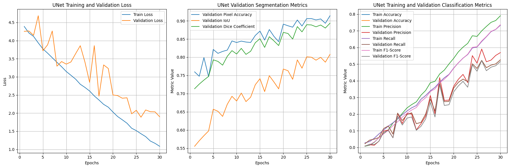

Left: training and validation loss. Middle: validation pixel accuracy, IoU, and Dice. Right: training and validation classification metrics.

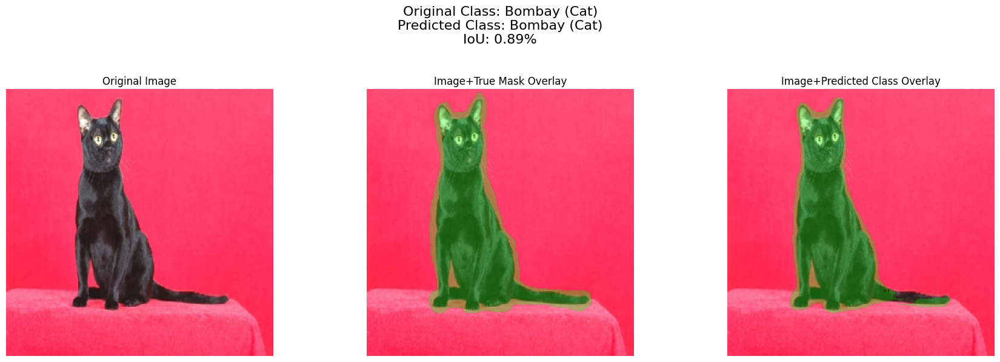

Test-time inference showing the original image, the ground truth mask overlay, and the predicted mask overlay, with true and predicted breed/species in the title.

### Attention U-Net

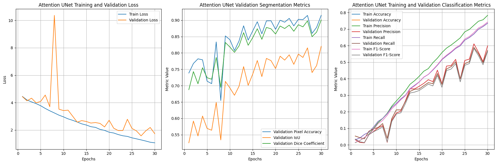

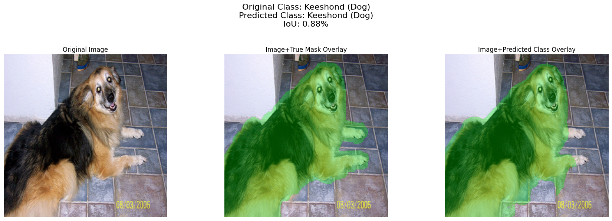

At the final epoch the Attention U-Net reached a validation pixel accuracy of 0.9149, validation IoU of 0.8202, and validation Dice of 0.9009, with a validation breed accuracy of 0.5717 and F1 of 0.5656.

### Model comparison

Both models were evaluated on the held-out test set with `test_model()`, which reports test loss, pixel accuracy, IoU, Dice, accuracy, precision, recall, and F1.

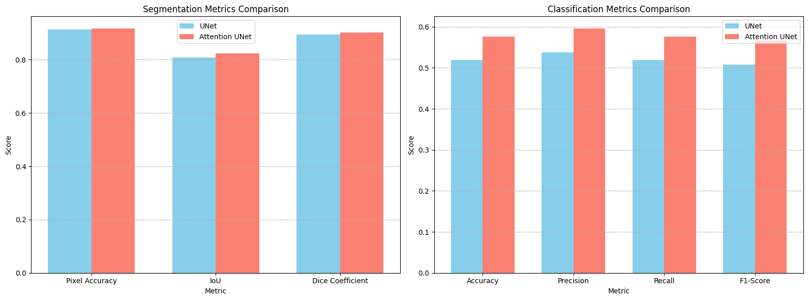

Segmentation performance is strong for both models, while breed classification is markedly harder: 37 fine-grained classes with fewer than 200 images each, trained from scratch without a pretrained backbone, and with the classifier depending only on globally pooled bottleneck features.

---

## Additional Experiments

### Augmentation vs no augmentation

A second U-Net was trained on the same splits with the augmentation pipeline replaced by the plain validation/test transform, keeping every other setting the same.

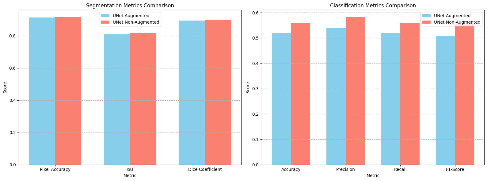

Test results for the non-augmented U-Net:

| Metric | Value |
|---|---|
| Test loss | 1.8722 |
| Pixel accuracy | 0.9146 |
| IoU | 0.8173 |
| Dice | 0.8991 |
| Accuracy | 0.5607 |
| Precision | 0.5814 |
| Recall | 0.5607 |
| F1-score | 0.5536 |

### Learning rate comparison

Four U-Net models were trained for 10 epochs each with AdamW at learning rates of 1, 0.1, 0.01, and 0.001, and their validation IoU, validation accuracy, and validation loss curves were compared.

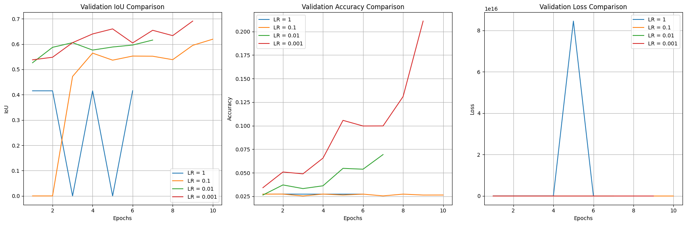

At lr = 1 training was unstable: validation IoU collapsed to 0 in some epochs and validation loss diverged to extremely large values. At lr = 0.1 segmentation began to learn but classification stayed near chance. Lower learning rates trained stably, and 0.001 was used for all main experiments.

---

## Acknowledgements

This project is a part of Image Processing (CSE428) course.
